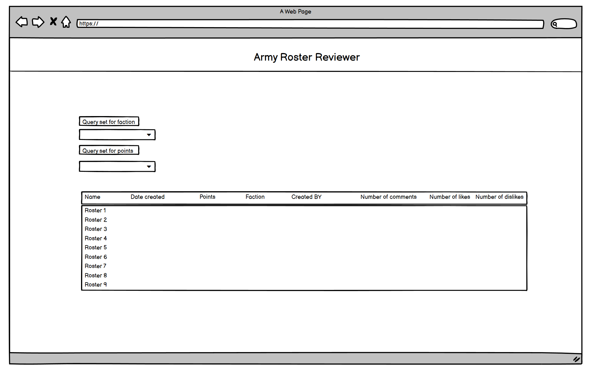
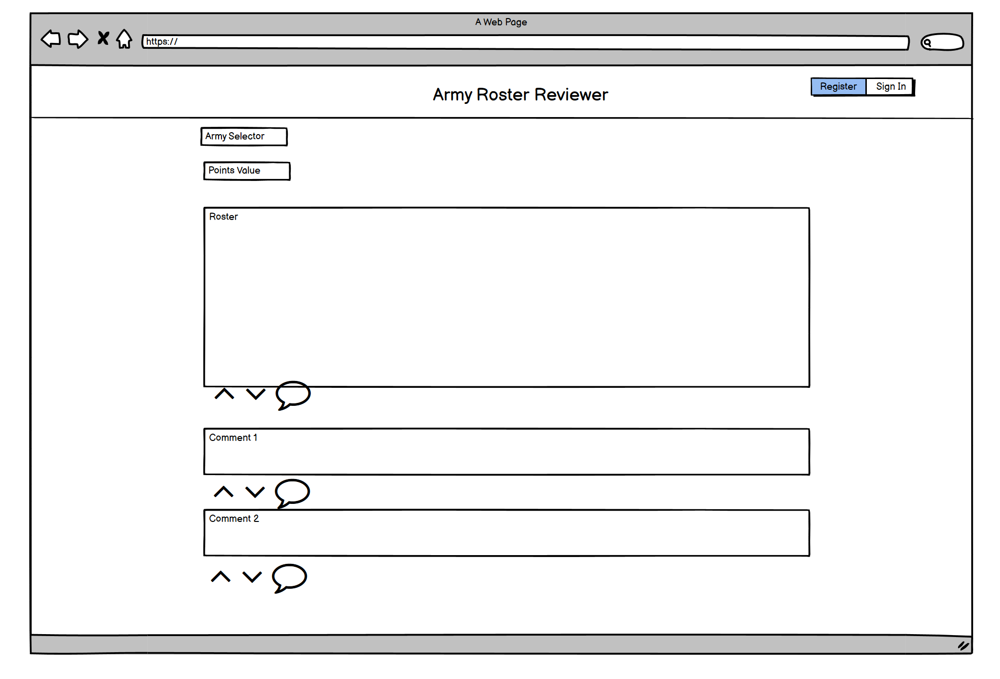

## Contents

* Reasons for this project
* UX
* User stories
* Future builds
* Deployment
* Wire frame
* Languages
* Libraries and other technologies
* Testing

## Reasons for this project

This site will be used to allow people to post their army lists and recieve feed back on them.

## UX

This site is designed for people who play warhammer 40k, who have made an army list and either want to brag about how good it is or get recommendations on how to improve it. It will give people the abillity to like or dislike the roster and add comments to it also.
***
I have chose to use similar Ui to other sites serving to the same community, for example: 
1. [Bolter and Chainsword](http://www.bolterandchainsword.com/)
2. [Element Games](https://elementgames.co.uk/)
3. [Battleground Gaming](https://battlegroundgaming.co.uk/)
4. [Warhammer Community](https://www.warhammer-community.com/)
***

***

***

***

## Future builds

Future builds will include:
* Back grounds, which will change depending on which faction has been selected.
* The ability to create a unit that is held in a model and add it into the roster rather than creating on a third party app and pasting it in or typing it out in full
* Have an image for each army which will post in roster detail template depending on which faction you pick

## Deployment

1. Ensure all the dependencies are included by adding them to the requirements.txt file by running the following command in the terminal: pip3 freeze > requirements.tx
2. Ensure the project has been fully committed and pushed to git 
3. Go to your heroku account, if you don't have one create one
4. On the home screen click on the create new app button
5. Enter a name for the project and select your region to the correct region.
6. On the next screen select settings
7. Go to config vars and click reveal config vars
8. Switch to the program file and where you are keeping your credentials copy these and then on heroku enter a name for the key and paste the code into the config vars value box and click add
9. Now scroll down to buildPacks and click add build packs
10. First select python and click save changes
11. Click back into build packs and choose node.js and click save again
12. Ensure that the Python  build pack is at the top of the list you are abe to drag and drop if you need to rearrange
13. Now select deploy
14. From the deployment method select GitHub
15. Then click on the connect to github button that appears
16. Click into the search box and search for the project name
16. Once located select connect
17. Then click deploy branch, this will then be shown in the box below
18. You can the click view to show the app in a browser

The program can be deployed automatically but i have chosen to keep it as a manual deploy so i can ensure that while i am testing and have no intention of adding more to the code currently it is better to deploy it manually meaning returning to the screen and clicking deploy branch each time you want to make any changes.

### Making a clone to run locally

* Log into GitHub.
* Select the repository.
* Click the Code dropdown button next to the green Gitpod button.
* Download ZIP file and unpackage locally and open with IDE. Alternatively copy the URL in the HTTPS box.
* Open the alternative editor and terminal window.
* Type 'git clone' and paste the copied URL.
* Press Enter. A local clone will be created.

## Wire frame

* 
***
* 

## Languages

* [Python](https://en.wikipedia.org/wiki/Python_(programming_language))
* [HTML5](https://en.wikipedia.org/wiki/HTML5)
* [CSS3](https://en.wikipedia.org/wiki/CSS)

## Libraries and other technologies

* [Django](https://www.djangoproject.com/)
* [Heroku](https://en.wikipedia.org/wiki/Heroku)
* [Font Awesome](https://fontawesome.com/)
* [GitHub](https://github.com/)
* [Cloudinary](https://cloudinary.com/)
* [Summer Note](https://summernote.org/)
* [Crispy forms](https://django-crispy-forms.readthedocs.io/en/latest/)
* [OAuth](https://oauth.net/)

## Testing

### Validation Testing

* [HTML testing](https://validator.w3.org/)
1.  Index page validation, all tests passed.
***
2.  RosterDetail Validation completed, although there were errors these could not be helped due to being generated from summernote.
***
3.  CreateRoster Validation completed, although there were errors these could not be helped due to being generated from summernote.
***
4.  Register Validation completed, all tests passed.
***
5.  SignIn Validation completed, all tests passed.
***
6.  Sign Out Validation completed, all tests passed.
***
* [CSS testing](https://jigsaw.w3.org/css-validator/validator)
1. 
***
* [PEP8 testing](http://pep8online.com/) Any Django code not written by me has not been held to the PEP8 standards but all of my code has been.
1. Models.py tested and completed
2. Views.py tested and completed
3. Test.py tested and completed
4. Urls.py tested and completed

### Manual Testing

#### The site has been tested by:- 
* Upon accessing the home page, you are not logged in
* Proceed to any of the links
* Ensure that no comments can be entered and that the post cannot be liked or disliked
* Click home to return to the index page
* Click register and create an account
* Ensure upon creating the account you are now back on the index page
* Click create roster
* Fill in all the fields and click submit
* Returned to the index page note the new post entered now appears 
* Click into the the post
* Click on the like dislike buttons to check on their functionality
* Add a comment and click submit
* Ensure the comment appears under the post
* Click home link
* Ensure the table is now updated with correct amount of likes, dislike and / or comments
* Click sign out and then confirm sign out to ensure you are now signed out and returned to the index page

#### Responsiveness checked on the following devices
* PC various screen sizes resized manually with dev tools
* Iphone 11
* IPad air
* Samsung galaxy A51

### Automated test

#### Automated have been written to check the following
* Ensure the default development parameter is uncommented

* Type into terminal "python3 manage.py test"
* Watch tests complete

